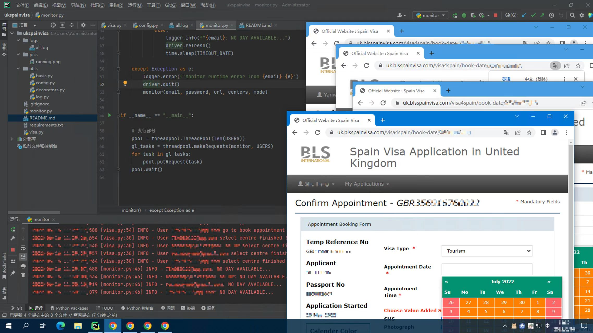

# UKSpainVisa
### I. Introduction
CSN7841/UKSpainVisa是一个开源的刷slot的python脚本，本人自己的签证是800RMB代刷来的。

偶然之下看到了vxwong的[spain-visa-monitor](https://github.com/vxwong/spain-visa-monitor)项目，从而有了改进优化的想法。

代码主要使用[selenium](https://github.com/SeleniumHQ/selenium)实现页面点击和输入，
使用ultrafunkamsterdam的[undetected-chromedriver](https://github.com/ultrafunkamsterdam/undetected-chromedriver)来实现绕过浏览器检测。

本项目开源免费，仅供解决个人问题，禁止兜售代码等商业行为，GITHUB的代码嵌入指纹，商业运用可能会被追究责任。



### II. Functions
从打开页面到输入密码，从选择日期到自动确认，一切流程全自动，主需要在config.py下进行配置即可。

!!!新增的线程池功能，可以多线程并发，多账号使用。

保留了vxwong的语音提示功能，只不过是在你点击了confirm之后了。。。

### III. File Structure
搬运自vxwong的readme.md的"二，文件介绍"部分有兴趣可以查看原版[spain-visa-monitor](https://github.com/vxwong/spain-visa-monitor)
```text
.
├── monitor.py         # 主程序流程
├── visa.py            # 主要功能流程位置
├── utils
│   ├── basic.py       
│   ├── config.py      # 配置文件，使用前修改
│   ├── decorators.py
│   └── log.py
├── requirements.txt   # pip install -r requirements.txt 使用前安装依赖
└── readme.md
```

### IV. Run for your Visa!

1. 安装Python，请参考vxwong的内容。

3. 修改config.py

```python
# =============== GENERAL SETTINGS ===============
TIMEOUT = 90  # 无日期后刷新间隔

# =============== VISA CENTER SELECTION ===============
CENTER_MAN = ('England', 'Manchester', 'Normal', 'Tourism')
CENTER_EDN = ('Scotland', 'Edinburgh', 'Normal', 'Tourism')
CENTER_LON = ('Bristol', 'London', 'Normal', 'Tourist')

# ======================= MODE =========================
# 日期选择页面的4个勾勾，从上到下的顺序，可以自己选择
# 不使用加急
MODE_NORMAL = ('Yes', 'Yes', 'No', 'Yes')
# 使用加急
MODE_FAST = ('Yes', 'Yes', 'Yes', 'Yes')

# =============== PERSONAL CONFIG FOR VISA ===============
FIXED = 'https://uk.blsspainvisa.com/visa4spain/book-appointment/'

# ======================= USER LIST =======================
# 这里添加客户
# 账号参数: Email, 密码, 链接地址, 中心地点(CENTER_MAN, CENTER_EDN, CENTER_LON), 是否优先(MODE_NORMAL, MODE_FAST), None是启动线程池的默认参数
No1 = (['yourEmail@xxx.com', '@password@', 'X6Wnq5mw23', CENTER_MAN, MODE_FAST], None) # None 必须保留线程池参数
No2 = (['secondPersonEmail@xxx.com', '@password@', 'X6Wnq5ms5f', CENTER_EDN, MODE_NORMAL], None)
# 加入线程池，就算前面配置了账号，不加入这里面也没用，USERS就是要在主程序中调用的线程池
USERS = [No1, No2] # ！！！！
```

3. 安装依赖
   (搬运自vxwong 三、3.)
    打开cmd/终端，输入pip install[空格]，将requirements.txt拖入cmd/终端，回车
    ```shell
    pip install -r requirements.txt
    ```
4. 运行
   可以使用IDE直接运行，也可以使用终端，终端使用参考vxwong "三、4."
   启动后就不要乱动了，浏览器会自行完成操作，每隔一阵会因为元素过期(网页登录时间限制)自己重启。
